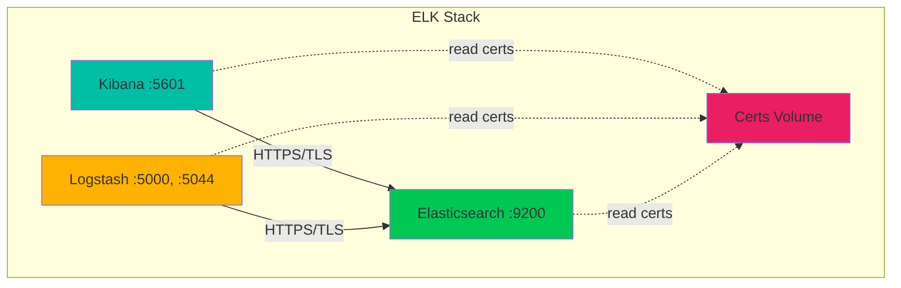

# 🔐 Stack ELK Sécurisée avec TLS/SSL

Stack complète **Elasticsearch + Logstash + Kibana** avec génération automatique de certificats TLS/SSL via Docker.

---

## 📋 Table des matières

- [🎯 Vue d'ensemble](#-vue-densemble)
- [🏗️ Architecture](#️-architecture)
- [⚙️ Prérequis](#️-prérequis)
- [🚀 Installation rapide](#-installation-rapide)
- [🔧 Configuration](#-configuration)
- [📖 Utilisation](#-utilisation)
- [🔐 Sécurité](#-sécurité)
- [🛠️ Dépannage](#️-dépannage)

---

## 🎯 Vue d'ensemble

Ce projet fournit une **stack ELK complète** avec :

- ✅ **Génération automatique de certificats** TLS/SSL (CA + certificats serveur/client)
- ✅ **Chiffrement bout-en-bout** de toutes les communications
- ✅ **Docker Compose** pour un déploiement simple
- ✅ **Health checks** automatiques
- ✅ **Volumes persistants** pour les données
- ✅ **Configuration via variables d'environnement**

### Composants

| Service | Version | Description | Port |
|---------|---------|-------------|------|
| **Elasticsearch** | 8.15.0 | Moteur de recherche et stockage | 9200, 9300 |
| **Logstash** | 8.15.0 | Pipeline de traitement | 5000, 5044, 9600 |
| **Kibana** | 8.15.0 | Interface web de visualisation | 5601 |
| **Setup (init)** | Python 3.13 | Génération des certificats | - |

---

## 🏗️ Architecture



---

## ⚙️ Prérequis

### Système

- **Docker** ≥ 20.10
- **Docker Compose** ≥ 2.0
- **RAM** : Minimum 4GB (8GB recommandé)
- **Espace disque** : 20GB minimum

### Ports disponibles

Les ports suivants doivent être libres :

| Port | Service | Usage |
|------|---------|-------|
| `5000` | Logstash | TCP/UDP input |
| `5044` | Logstash | Beats input |
| `5601` | Kibana | Interface web |
| `9200` | Elasticsearch | HTTP API |
| `9300` | Elasticsearch | Transport |
| `9600` | Logstash | Monitoring API |

---

## 🚀 Installation rapide (pas encore terminer)

### Étape 1 : Cloner le projet

```bash
git clone https://github.com/Creator39/ELK.git
cd ELK
```

### Étape 2 : Créer le fichier `.env`

```bash
# Copier le template (quand il sera disponible)
cp .env.example .env

# Ou créer manuellement
cat > .env << 'EOF'
# Elasticsearch
ELASTIC_PASSWORD=VotreMotDePasseSecurise123!
KIBANA_SYSTEM_PASSWORD=AutreMotDePasseSecurise456!

# Chemins des certificats
ES_CERT_PATH=/usr/share/elasticsearch/config/certs/elasticsearch/elasticsearch_cert.pem
ES_KEY_PATH=/usr/share/elasticsearch/config/certs/elasticsearch/keys/elasticsearch_private.pem
CA_CERT_PATH=/usr/share/elasticsearch/config/certs/ca/ca_cert.pem

# Logstash
LOGSTASH_PASSWORD=LogstashPassword789!
EOF
```

> ⚠️ **Important** : Changez les mots de passe par défaut !

### Étape 3 : Démarrer la stack

```bash
docker-compose -f Docker_Compose_ELK.yml up -d
```

### Étape 4 : Vérifier l'état

```bash
# Voir les logs en temps réel
docker-compose -f Docker_Compose_ELK.yml logs -f

# Vérifier l'état des services
docker-compose -f Docker_Compose_ELK.yml ps
```

### Étape 5 : Accéder aux interfaces

**Kibana** : http://localhost:5601
- Username : `elastic`
- Password : Celui défini dans `.env`

**Elasticsearch** : https://localhost:9200
```bash
curl -k -u elastic:VotreMotDePasse https://localhost:9200
```

---

## 🔧 Configuration

### 📁 Structure du projet

```
ELK/
│
├── 📄 Docker_Compose_ELK.yml        # ⚠️ Template - en cours de complétion
├── 📄 Dockerfile                     # ✅ Image init pour certificats
├── 📄 main.py                        # ✅ Script génération certificats
├── 📄 generate_certs.py              # ✅ Logique de génération
├── 📄 certs_config.yaml              # ✅ Config des certificats
├── 📄 pyproject.toml                 # ✅ Dépendances Python
├── 📄 README.md                      # 📖 Ce fichier
│
├── 📂 utils/                         # ✅ Modules Python
│   ├── CertificateManager.py         # Gestion certificats
│   ├── KeyManager.py                 # Gestion clés privées
│   ├── load_config.py                # Chargement config
│   └── __init__.py
│
├── 📂 logstash/                      # ⚠️ À implémenter
│   ├── config/
│   │   ├── logstash.yml              # Config principale
│   │   └── pipelines.yml             # Config pipelines
│   └── pipeline/
│       └── logstash.conf             # Pipeline de données
│
└── 📂 certs_output/                  # 🔒 Généré automatiquement
    ├── ca/
    │   ├── ca_cert.pem
    │   └── keys/ca_private.pem
    ├── elasticsearch/
    │   ├── elasticsearch_cert.pem
    │   ├── ca_cert.pem
    │   └── keys/elasticsearch_private.pem
    ├── logstash/
    │   ├── logstash_cert.pem
    │   ├── ca_cert.pem
    │   └── keys/logstash_private.pem
    └── kibana/
        ├── kibana_cert.pem
        ├── ca_cert.pem
        └── keys/kibana_private.pem
```

**Légende** :
- ✅ = Implémenté et fonctionnel
- ⚠️ = En cours de développement
- 🔒 = Généré automatiquement (ne pas modifier manuellement)

---

### 📝 Personnalisation des certificats

Modifiez le fichier `certs_config.yaml` selon vos besoins :

```yaml
ca:
  common_name: "VotreCA"
  validity_days: 3650        # 10 ans
  organization: "VotreOrg"
  country: "FR"

services:
  elasticsearch:
    type: server
    validity_days: 365
    dns_names:
      - "votre-domaine.com"
      - "es.votre-domaine.com"
    ip_addresses:
      - "192.168.1.100"
```

Puis regénérez les certificats :

```bash
# Option 1 : Via Docker
docker run --rm -v $(pwd)/certs_output:/app/certs_output init_cont:1.0.0

# Option 2 : Via Docker Compose
docker-compose -f Docker_Compose_ELK.yml up setup --force-recreate
```

---

## �� Utilisation

### Envoyer des données à Logstash

#### Via TCP (port 5000)

```bash
echo '{"message": "Hello ELK", "service": "test"}' | nc localhost 5000
```

#### Via Filebeat

```yaml
# filebeat.yml
output.logstash:
  hosts: ["localhost:5044"]
  ssl.certificate_authorities: ["./certs_output/ca/ca_cert.pem"]
```

---

### Rechercher dans Elasticsearch

```bash
# Liste des indices
curl -k -u elastic:password https://localhost:9200/_cat/indices?v

# Recherche dans tous les indices logstash-*
curl -k -u elastic:password https://localhost:9200/logstash-*/_search?pretty
```

---

### Créer un dashboard Kibana

1. Accédez à http://localhost:5601
2. Menu **☰** → **Analytics** → **Discover**
3. Créez un **Index Pattern** : `logstash-*`
4. Menu **☰** → **Analytics** → **Dashboard** → **Create dashboard**

---

## 🔐 Sécurité

### ✅ Bonnes pratiques implémentées

- ✅ TLS/SSL sur toutes les communications Elasticsearch
- ✅ Certificats auto-signés avec CA dédiée
- ✅ Authentification requise sur tous les services
- ✅ Variables d'environnement pour les secrets
- ✅ Volumes Docker isolés
- ✅ Health checks automatiques

---

### ⚠️ Points d'attention

> **IMPORTANT** : Ce setup est conçu pour le **développement/test**.

**Pour la production**, consultez `SECURITY_RECOMMENDATIONS.md` :

- [ ] Chiffrer les clés privées avec passphrase
- [ ] Utiliser Docker Secrets au lieu de `.env`
- [ ] Activer HTTPS sur Kibana
- [ ] Configurer un reverse proxy (Nginx/Traefik)
- [ ] Mettre en place des sauvegardes automatiques
- [ ] Limiter les ressources CPU/RAM
- [ ] Utiliser des certificats signés par une CA reconnue
- [ ] Activer l'audit logging

---

### 🔑 Gestion des mots de passe

**Ne jamais committer le fichier `.env` !**

```bash
# Ajouter au .gitignore
echo ".env" >> .gitignore
```

#### Changer les mots de passe

```bash
# Se connecter au conteneur Elasticsearch
docker exec -it elasticsearch bash

# Changer le mot de passe elastic
bin/elasticsearch-reset-password -u elastic

# Changer le mot de passe kibana_system
bin/elasticsearch-reset-password -u kibana_system
```

---

## 🛠️ Dépannage

### ❌ Problème : "Connection refused" sur Elasticsearch

**Symptôme** : `curl: (7) Failed to connect to localhost port 9200`

**Diagnostic** :
```bash
# Vérifier les logs
docker-compose -f Docker_Compose_ELK.yml logs elasticsearch

# Vérifier le health status
docker inspect elasticsearch | grep -A 10 Health
```

**Solution** : Attendre que le health check soit "healthy" (1-2 min au premier démarrage)

---

### ❌ Problème : "Certificate verification failed"

**Symptôme** : `SSL: CERTIFICATE_VERIFY_FAILED`

**Diagnostic** :
```bash
# Vérifier que les certificats existent
docker exec elasticsearch ls -la /usr/share/elasticsearch/config/certs/
```

**Solution** :
```bash
# Regénérer les certificats
docker-compose -f Docker_Compose_ELK.yml up setup --force-recreate
docker-compose -f Docker_Compose_ELK.yml restart
```

---

### ❌ Problème : Kibana affiche "Kibana server is not ready yet"

**Symptôme** : Page blanche avec ce message

**Diagnostic** :
```bash
docker-compose -f Docker_Compose_ELK.yml logs kibana | grep -i error
```

**Solution** : Vérifier que `ELASTICSEARCH_PASSWORD` dans `.env` correspond au mot de passe `kibana_system`

---

### ❌ Problème : "Out of memory"

**Symptôme** : Elasticsearch crash ou ne démarre pas

**Diagnostic** :
```bash
free -h
docker stats
```

**Solution** : Réduire la RAM allouée dans `Docker_Compose_ELK.yml`
```yaml
environment:
  - "ES_JAVA_OPTS=-Xms1g -Xmx1g"  # Au lieu de 2g
```

---

### 🧹 Nettoyer et redémarrer

```bash
# Arrêter tous les services
docker-compose -f Docker_Compose_ELK.yml down

# ⚠️ Supprimer les volumes (PERTE DE DONNÉES)
docker-compose -f Docker_Compose_ELK.yml down -v

# Nettoyer les images inutilisées
docker system prune -a

# Redémarrer proprement
docker-compose -f Docker_Compose_ELK.yml up -d
```

---

## 📚 Ressources

### Documentation officielle

- [Elasticsearch Reference](https://www.elastic.co/guide/en/elasticsearch/reference/current/index.html)
- [Logstash Reference](https://www.elastic.co/guide/en/logstash/current/index.html)
- [Kibana Guide](https://www.elastic.co/guide/en/kibana/current/index.html)

### Sécurité

- [Security Settings (Elasticsearch)](https://www.elastic.co/guide/en/elasticsearch/reference/current/security-settings.html)
- [Securing the Elastic Stack](https://www.elastic.co/guide/en/elasticsearch/reference/current/secure-cluster.html)

---

## 📊 État du projet

| Composant | État | Notes |
|-----------|------|-------|
| Génération certificats | ✅ Complet | Fonctionnel via init container |
| Elasticsearch | ⚠️ Template | TLS configuré, variables à compléter |
| Logstash | ⚠️ Template | Config à créer |
| Kibana | ⚠️ Template | Variables à compléter |
| Documentation | ✅ Complet | README à jour |

---

## 📄 Licence

Ce projet est fourni à des fins éducatives et de développement.

---

## 🤝 Contribution

Les contributions sont les bienvenues ! 

1. Fork le projet
2. Créer une branche (`git checkout -b feature/AmazingFeature`)
3. Commit les changements (`git commit -m 'Add AmazingFeature'`)
4. Push vers la branche (`git push origin feature/AmazingFeature`)
5. Ouvrir une Pull Request

---

**Fait avec ❤️ pour la communauté ELK** (une fois terminer)
